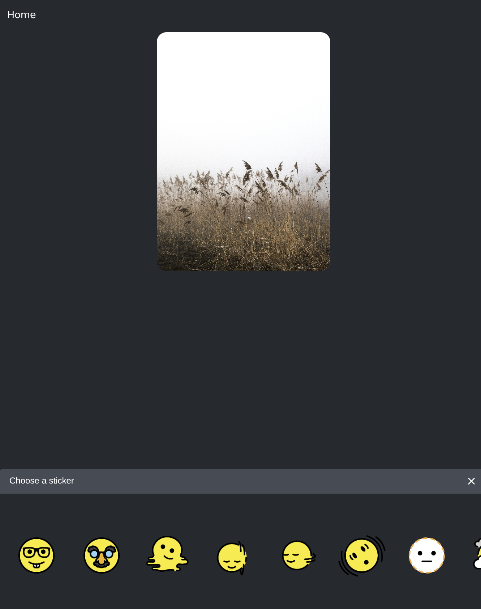

# Emoji Sticker App created with [Expo](https://expo.dev)

A React Native app built with Expo that lets users add emojis to images, animate them with drag and transform gestures, and download the final result. The app also features buttons, tabs, and smooth animations for a rich user experience.

## Get started

   ```bash
   npm install
   //Install dependencies

   npx expo start
   //start the app

   npm run reset-project
   //get a fresh project
   
   ```
## Features

- Select or pick images from the device gallery
- Add emoji stickers on top of images
- Drag, scale, and transform emojis with gestures
- Download the edited image to device storage
- Smooth animations using `react-native-reanimated`
- Responsive UI with buttons and tabs

## Technologies Used

- React Native  
- Expo  
- react-native-gesture-handler  
- react-native-reanimated  
- expo-image-picker  

## Screenshots
<table>
  <tr>
    <td style="width: 50%;"></td>
    <td style="width: 50%;"></td>
  </tr>
</table>
